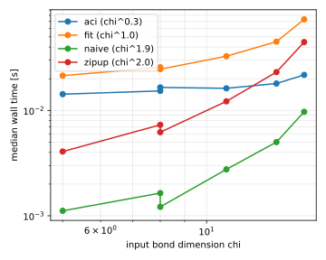
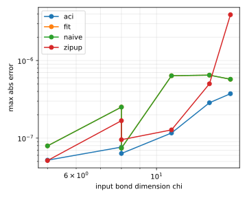

# elementwise_fourier

| algorithm | points | fitted time exponent | worst max abs error |
|---|---|---|---|
| aci | 5 | 0.76 | 2.86e-07 |
| fit | 5 | 1.31 | 6.49e-07 |
| naive | 5 | 2.32 | 6.49e-07 |
| zipup | 5 | 1.60 | 5.02e-07 |

