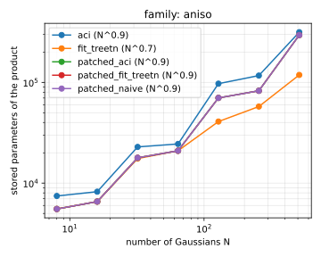
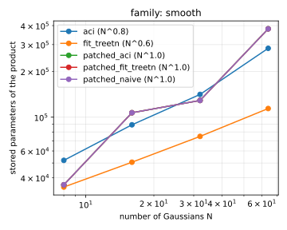
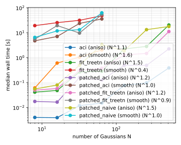
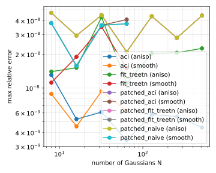

# elementwise_gauss2d_patched

| algorithm | points | fitted time exponent | worst max relative error |
|---|---|---|---|
| aci (aniso) | 7 | 1.13 | 1.31e-08 |
| aci (smooth) | 4 | 1.60 | 9.34e-09 |
| fit_treetn (aniso) | 7 | 1.49 | 4.29e-08 |
| fit_treetn (smooth) | 4 | 0.43 | 3.52e-08 |
| patched_aci (aniso) | 7 | 1.16 | 4.69e-08 |
| patched_aci (smooth) | 4 | 1.05 | 4.09e-08 |
| patched_fit_treetn (aniso) | 7 | 1.25 | 4.69e-08 |
| patched_fit_treetn (smooth) | 4 | 0.88 | 3.79e-08 |
| patched_naive (aniso) | 7 | 1.49 | 4.69e-08 |
| patched_naive (smooth) | 4 | 1.00 | 3.79e-08 |

Note: this case runs two instance families, recorded per arm as family and tabulated separately below, and it is controlled by the accuracy instead of by a fixed output budget. The default family aniso is N anisotropic narrow spikes at a fixed spacing-to-width ratio, whose random orientations and aspect ratios push the global rank toward the geometric bound of the bit count; smooth is the density-constant isotropic family of elementwise_gauss2d_scaling. Every arm is asked for the same global relative tolerance rtol, and what the case measures is the size and the time each one needs to reach it, so the arms are comparable only because rtol is the same for all of them and the error column is a check that they got there rather than the discriminator. The size metric is n_params, the total number of stored core entries: a bond dimension says nothing across the two representations here, since a patched arm holds one train per patch and no single global rank exists. For the patched arms n_params counts the free sites of each patch only, the cores at the projected sites being one-hot copy selectors that carry structure rather than data. The patched arms build each input as a partitioned tensor train, split until every patch fits under the per-patch rank cap, form the product patch pair by patch pair, and budget the result once at the end with volume-proportional absolute budgets, which is what makes shrinking patch norms harmless. Which construction split the inputs is recorded per arm as input_path: the default norm builds one global train per input and splits it by Frobenius norms, so its input_build_secs includes that global build, while tci runs a TCI per patch on the function and forms no global train at all. The two global arms fit_treetn and aci are the case-3 arms run tolerance-driven at the same rtol with no binding rank cap, and each has its own N ceiling, since the uncapped global fit is orders of magnitude more expensive than the interpolating arm. Input construction is not part of the reported wall time: it is recorded separately as input_build_secs, since one build is shared by every arm of an instance. The fitted time exponent is measured against N.

# Family: aniso

N anisotropic narrow spikes: minor width sigma fixed, aspect ratio log-uniform in [1, rho_max] and orientation uniform in [0, pi) drawn per spike, mean spacing held at a fixed number of minor widths so the box grows like sqrt(N) and R resolves sigma to a quarter step. This is the family the case defaults to: a field of small hard features whose global rank climbs like N^0.5 while a patched representation is held at its per-patch cap by construction; the geometric bound of the bit count also grows like sqrt(N) as R follows the box, so this is a contest of growth rates rather than a wall. The isotropic control of the same family, rho_max = 1, grows the same way, so the rank comes from the density of narrow features rather than from the anisotropy.

## Instances

| N | box half-width L | bits per variable R | input patches f, g | input params, patched | patched build [s] | global chi_in | input params, global | global build [s] |
|---|---|---|---|---|---|---|---|---|
| 8 | 0.212 | 6 | 1, 1 | 9488 | 0.06 | 45 | 12352 | 0.03 |
| 16 | 0.300 | 6 | 1, 1 | 11712 | 0.07 | 53 | 14528 | 0.02 |
| 32 | 0.424 | 7 | 1, 1 | 29076 | 0.30 | 64 | 39040 | 0.08 |
| 64 | 0.600 | 7 | 1, 1 | 38080 | 0.40 | 64 | 43840 | 0.09 |
| 128 | 0.849 | 8 | 4, 4 | 116580 | 12.41 | 88 | 92552 | 0.46 |
| 256 | 1.200 | 8 | 4, 4 | 152000 | 29.04 | 120 | 128460 | 0.63 |
| 512 | 1.697 | 9 | 16, 16 | 456956 | 197.79 | 182 | 267264 | 2.72 |

## Size and time at equal accuracy

| algorithm | N | median time [s] | max relative error | params | patches | max patch bond | pairs | pairs time [s] | truncate time [s] |
|---|---|---|---|---|---|---|---|---|---|
| aci | 8 | 0.0040 | 1.31e-08 | 7456 | one train | 54 | not patched | not patched | not patched |
| aci | 16 | 0.0039 | 5.27e-09 | 8224 | one train | 60 | not patched | not patched | not patched |
| aci | 32 | 0.0119 | 6.09e-09 | 22880 | one train | 64 | not patched | not patched | not patched |
| aci | 64 | 0.0151 | 3.41e-09 | 24480 | one train | 64 | not patched | not patched | not patched |
| aci | 128 | 0.0770 | 5.78e-09 | 97168 | one train | 182 | not patched | not patched | not patched |
| aci | 256 | 0.0971 | 5.57e-09 | 116876 | one train | 213 | not patched | not patched | not patched |
| aci | 512 | 0.3868 | 4.44e-09 | 315040 | one train | 256 | not patched | not patched | not patched |
| fit_treetn | 8 | 0.0413 | 1.40e-08 | 5536 | one train | 39 | not patched | not patched | not patched |
| fit_treetn | 16 | 0.0483 | 1.52e-08 | 6560 | one train | 47 | not patched | not patched | not patched |
| fit_treetn | 32 | 0.2669 | 4.29e-08 | 17532 | one train | 63 | not patched | not patched | not patched |
| fit_treetn | 64 | 0.2856 | 1.10e-08 | 20960 | one train | 64 | not patched | not patched | not patched |
| fit_treetn | 128 | 2.2442 | 2.03e-08 | 40864 | one train | 80 | not patched | not patched | not patched |
| fit_treetn | 256 | 2.8123 | 2.06e-08 | 57584 | one train | 108 | not patched | not patched | not patched |
| fit_treetn | 512 | 20.3180 | 2.26e-08 | 118568 | one train | 169 | not patched | not patched | not patched |
| patched_aci | 8 | 0.0175 | 4.69e-08 | 5536 | 1 | 39 | 1 | 0.005 | 0.013 |
| patched_aci | 16 | 0.0165 | 2.94e-08 | 6560 | 1 | 47 | 1 | 0.004 | 0.013 |
| patched_aci | 32 | 0.1587 | 4.47e-08 | 17848 | 1 | 63 | 1 | 0.020 | 0.139 |
| patched_aci | 64 | 0.1265 | 2.10e-08 | 20960 | 1 | 64 | 1 | 0.012 | 0.115 |
| patched_aci | 128 | 0.4928 | 4.37e-08 | 70128 | 4 | 64 | 4 | 0.056 | 0.437 |
| patched_aci | 256 | 0.4888 | 2.80e-08 | 82560 | 4 | 64 | 4 | 0.047 | 0.441 |
| patched_aci | 512 | 2.2450 | 4.44e-08 | 294680 | 28 | 64 | 28 | 0.341 | 1.903 |
| patched_fit_treetn | 8 | 0.0495 | 4.69e-08 | 5536 | 1 | 39 | 1 | 0.040 | 0.010 |
| patched_fit_treetn | 16 | 0.0577 | 2.94e-08 | 6560 | 1 | 47 | 1 | 0.046 | 0.011 |
| patched_fit_treetn | 32 | 0.3043 | 4.47e-08 | 17848 | 1 | 63 | 1 | 0.220 | 0.084 |
| patched_fit_treetn | 64 | 0.3737 | 2.10e-08 | 20960 | 1 | 64 | 1 | 0.280 | 0.094 |
| patched_fit_treetn | 128 | 1.2954 | 4.37e-08 | 70128 | 4 | 64 | 4 | 0.981 | 0.314 |
| patched_fit_treetn | 256 | 1.4741 | 2.80e-08 | 82560 | 4 | 64 | 4 | 1.122 | 0.352 |
| patched_fit_treetn | 512 | 11.1820 | 4.44e-08 | 294680 | 28 | 64 | 28 | 7.938 | 3.243 |
| patched_naive | 8 | 0.0554 | 4.69e-08 | 5536 | 1 | 39 | 1 | 0.046 | 0.010 |
| patched_naive | 16 | 0.0795 | 2.94e-08 | 6560 | 1 | 47 | 1 | 0.068 | 0.011 |
| patched_naive | 32 | 0.5005 | 4.47e-08 | 17848 | 1 | 63 | 1 | 0.416 | 0.084 |
| patched_naive | 64 | 3.2924 | 2.10e-08 | 20960 | 1 | 64 | 1 | 3.194 | 0.098 |
| patched_naive | 128 | 1.8800 | 4.37e-08 | 70128 | 4 | 64 | 4 | 1.569 | 0.311 |
| patched_naive | 256 | 13.2904 | 2.80e-08 | 82560 | 4 | 64 | 4 | 12.937 | 0.353 |
| patched_naive | 512 | 17.7775 | 4.44e-08 | 294680 | 28 | 64 | 28 | 16.321 | 1.456 |

# Family: smooth

N isotropic Gaussians of log-uniform inverse width at constant density, case 4's family. Smooth everywhere, so there is no hard region for the patching to isolate.

## Instances

| N | box half-width L | bits per variable R | input patches f, g | input params, patched | patched build [s] | global chi_in | input params, global | global build [s] |
|---|---|---|---|---|---|---|---|---|
| 8 | 6.000 | 10 | 1, 1 | 67368 | 1.85 | 79 | 102324 | 1.01 |
| 16 | 8.485 | 11 | 4, 4 | 163644 | 26.20 | 103 | 165304 | 2.10 |
| 32 | 12.000 | 11 | 6, 7 | 234952 | 58.80 | 117 | 222852 | 2.85 |
| 64 | 16.971 | 12 | 13, 16 | 432932 | 151.59 | 143 | 325416 | 5.76 |

## Size and time at equal accuracy

| algorithm | N | median time [s] | max relative error | params | patches | max patch bond | pairs | pairs time [s] | truncate time [s] |
|---|---|---|---|---|---|---|---|---|---|
| aci | 8 | 0.0610 | 8.85e-09 | 52048 | one train | 76 | not patched | not patched | not patched |
| aci | 16 | 0.6077 | 4.54e-09 | 89152 | one train | 95 | not patched | not patched | not patched |
| aci | 32 | 1.0491 | 9.34e-09 | 141176 | one train | 129 | not patched | not patched | not patched |
| aci | 64 | 2.0502 | 6.23e-09 | 283624 | one train | 183 | not patched | not patched | not patched |
| fit_treetn | 8 | 19.3066 | 1.12e-08 | 34752 | one train | 61 | not patched | not patched | not patched |
| fit_treetn | 16 | 25.3535 | 1.90e-08 | 50612 | one train | 80 | not patched | not patched | not patched |
| fit_treetn | 32 | 31.4667 | 3.52e-08 | 74800 | one train | 95 | not patched | not patched | not patched |
| fit_treetn | 64 | 48.2824 | 1.50e-08 | 114024 | one train | 120 | not patched | not patched | not patched |
| patched_aci | 8 | 4.7483 | 3.79e-08 | 35952 | 1 | 63 | 1 | 0.461 | 4.287 |
| patched_aci | 16 | 7.0666 | 1.58e-08 | 106972 | 14 | 58 | 16 | 0.665 | 6.401 |
| patched_aci | 32 | 23.6959 | 3.63e-08 | 128876 | 6 | 67 | 6 | 1.389 | 22.307 |
| patched_aci | 64 | 35.7547 | 4.09e-08 | 381004 | 33 | 60 | 64 | 2.544 | 33.210 |
| patched_fit_treetn | 8 | 5.5169 | 3.79e-08 | 35952 | 1 | 63 | 1 | 4.280 | 1.237 |
| patched_fit_treetn | 16 | 19.3617 | 1.58e-08 | 106972 | 14 | 58 | 16 | 17.531 | 1.831 |
| patched_fit_treetn | 32 | 9.7015 | 3.63e-08 | 128876 | 6 | 67 | 6 | 6.530 | 3.172 |
| patched_fit_treetn | 64 | 53.6306 | 3.75e-08 | 380632 | 33 | 60 | 64 | 47.016 | 6.613 |
| patched_naive | 8 | 6.4943 | 3.79e-08 | 35952 | 1 | 63 | 1 | 5.628 | 0.866 |
| patched_naive | 16 | 11.8447 | 1.58e-08 | 106972 | 14 | 58 | 16 | 9.965 | 1.880 |
| patched_naive | 32 | 13.1915 | 3.63e-08 | 128876 | 6 | 67 | 6 | 9.999 | 3.192 |
| patched_naive | 64 | 63.0637 | 3.75e-08 | 380632 | 33 | 60 | 64 | 24.510 | 38.552 |

