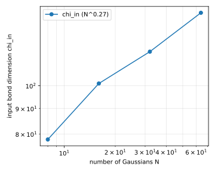
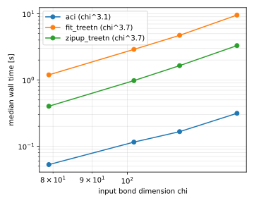
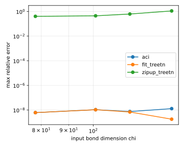

# elementwise_gauss2d_scaling

| algorithm | points | fitted time exponent | worst max relative error |
|---|---|---|---|
| aci | 4 | 3.11 | 9.34e-09 |
| fit_treetn | 4 | 3.65 | 6.51e-09 |
| zipup_treetn | 4 | 3.71 | 4.75e-01 |

Note: this case is the density-constant scaling study of elementwise_gauss2d. The number of Gaussians N is swept while the box area grows proportionally to N, box half-width L = L0 sqrt(N / N0), so the Gaussians per unit area stay fixed, and the bit count grows with the box, R = R0 + round(log2(L / L0)), so the grid spacing and hence the resolution per Gaussian stay roughly constant. The quantity of interest is the input rank chi_in as a function of N, reported in the instance table and the chi plot below. The elementwise product itself runs at the same fixed output budget chi_out <= chi_in as case 3, decided by the cap alone with an inert contract_tol. The naive arm of case 3 is excluded here: it forms the full chi_in-squared bond before truncating, which dominates the sweep at these ranks without adding a conclusion, since it tracks fit_treetn to the last reported digit in case 3. As in case 3, zipup_treetn spends the whole budget and still returns an order-unity relative error. The fitted time exponent is measured against input chi along a sweep of N, where the site count also grows, so it is not a pure chi power law.

## Instances and input rank

| N | box half-width L | bits per variable R | input rank chi_in |
|---|---|---|---|
| 8 | 6.000 | 10 | 79 |
| 16 | 8.485 | 11 | 102 |
| 32 | 12.000 | 11 | 117 |
| 64 | 16.971 | 12 | 139 |

Fitted over this sweep, chi_in grows like N^x with x = 0.26, against x = 0.5 for the sqrt(N) hypothesis and x = 1 for the linear one.

