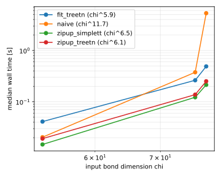
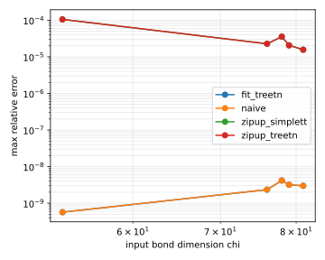

# mpo_mpo_quantics

| algorithm | points | fitted time exponent | worst max relative error |
|---|---|---|---|
| fit_treetn | 3 | 5.29 | 2.88e-08 |
| naive | 3 | 11.54 | 2.82e-08 |
| zipup_simplett | 3 | 6.16 | 1.05e-04 |
| zipup_treetn | 3 | 5.88 | 1.05e-04 |

Note: every algorithm contracts at the same output budget, its maximum bond dimension capped at the input rank chi, so the error column is the discriminator. naive and zipup_simplett run on the simplett engine, zipup_treetn and fit_treetn on treetn; both engines truncate relative to the largest singular value at the pinned revision. The two zipup arms are the same algorithm on the two engines, so their difference isolates the engine, and it is now confined to wall time. The fitted time exponent is measured against input chi along a sweep of r, where the site count also grows, so it is not a pure chi power law.

