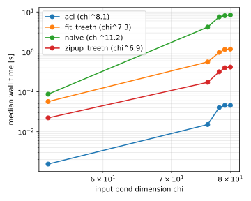
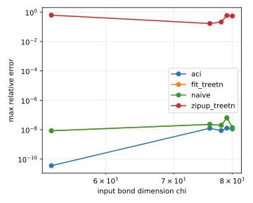

# elementwise_gauss2d

| algorithm | points | fitted time exponent | worst max relative error |
|---|---|---|---|
| aci | 5 | 8.08 | 1.28e-08 |
| fit_treetn | 5 | 7.26 | 6.40e-08 |
| naive | 5 | 11.23 | 6.39e-08 |
| zipup_treetn | 5 | 6.90 | 6.20e-01 |

Note: every algorithm forms the product at the same output budget, its maximum bond dimension capped at the input rank chi, so the error column is the discriminator. The exact elementwise product has rank up to chi squared, so this budget is tight: naive, fit_treetn and aci stay near the working tolerance while zipup_treetn spends the whole budget and still returns an order-unity relative error. Raising the budget recovers it, so that is the price of the fixed budget rather than a broken arm. There is no simplett arm here: simplett exposes no elementwise product for tensor trains at the pinned revision, so this case cannot compare the two engines on one algorithm the way case 2 does. The engine that ran each arm is recorded as engine: local for naive, treetn for the two hadamard arms, aci for the cross interpolation. The fitted time exponent is measured against input chi along a sweep of r, where the site count also grows, so it is not a pure chi power law.

